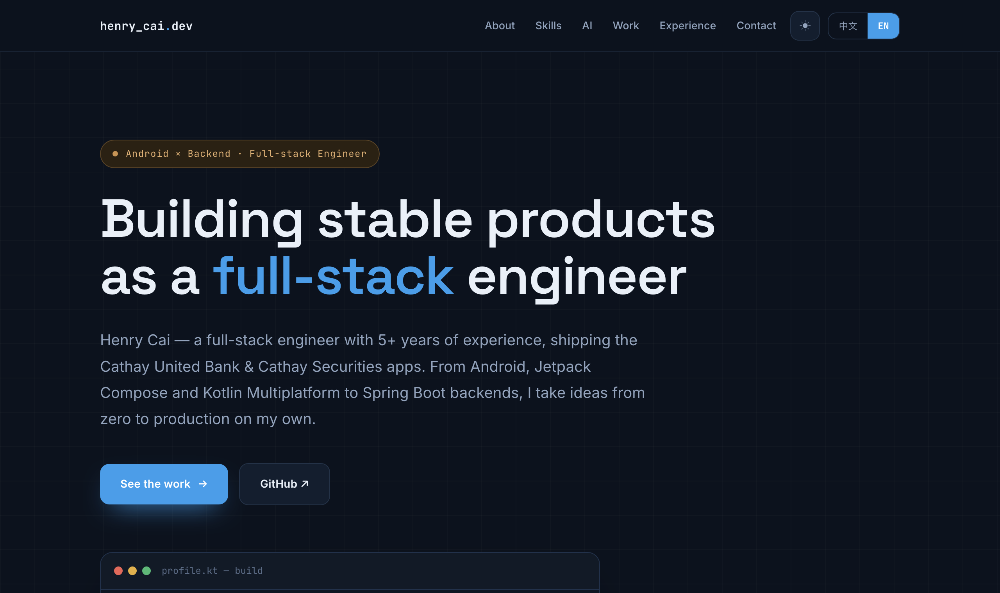
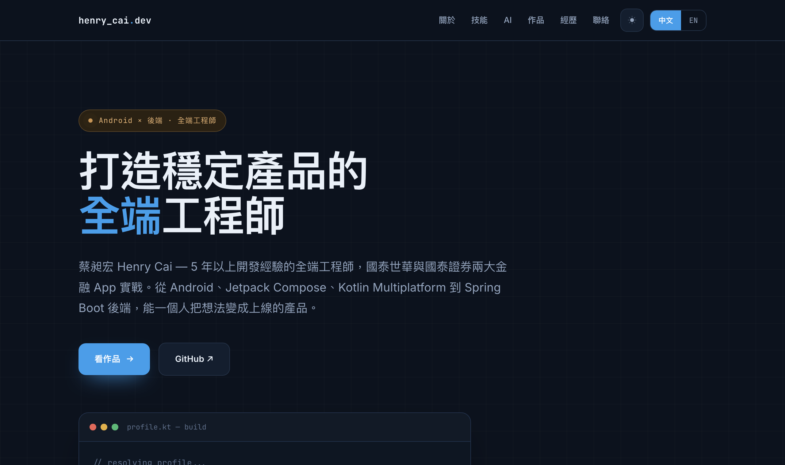
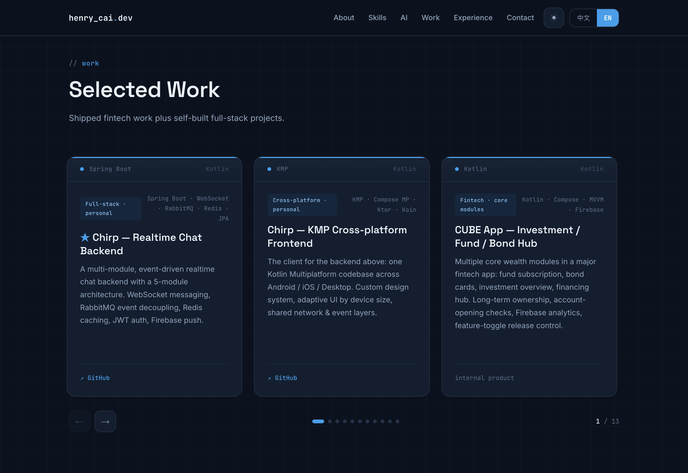
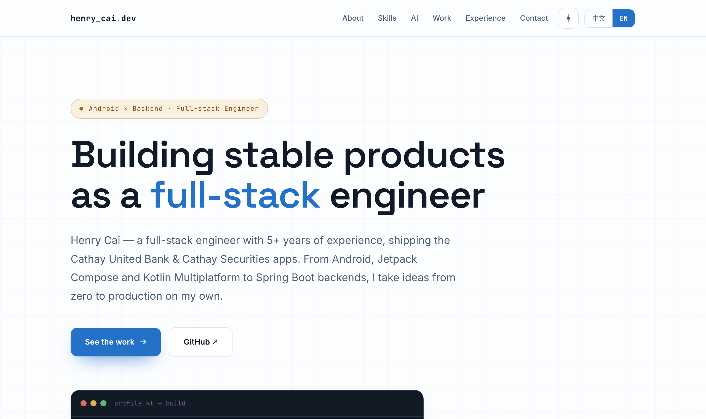
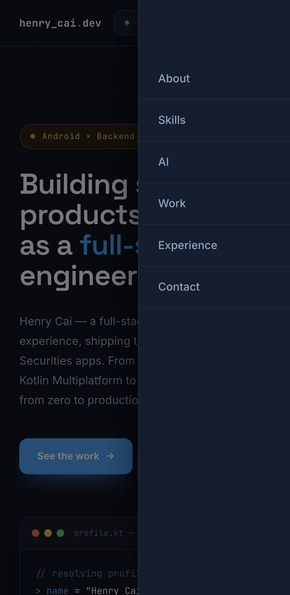

# Henry Cai — Personal Portfolio

A single-file, zero-build personal portfolio for **Henry Cai (蔡昶宏)** — mobile engineer working in
Kotlin, Jetpack Compose and Kotlin Multiplatform, extending into backend.
Bilingual (English / 繁體中文), dark & light themes, fully responsive.

**Live:** https://henrycai0317.github.io/henry_portfolio/

---

## Screenshots

### English (default)



### 中文



### Selected Work — scroll-snap carousel



### Light theme



### Mobile — slide-in drawer



---

## Features

| | |
|---|---|
| **Bilingual** | EN / 繁體中文, switched instantly with no page reload. English is the default. |
| **Remembers your language** | The choice is saved to `localStorage` and restored before first paint. |
| **Dark / light theme** | Two full CSS-variable palettes; the terminal block stays dark in both. |
| **Selected Work carousel** | Horizontal scroll-snap track with arrows, dot indicators and a live counter. |
| **Responsive** | Desktop nav collapses into a slide-in drawer at ≤ 760px. |
| **Motion-aware** | Everything animated is disabled under `prefers-reduced-motion`. |
| **No build step** | One `index.html`. No bundler, no dependencies, no npm install. |

---

## Running locally

The page is a single static file, so anything that serves a directory works:

```bash
python3 -m http.server 8000
```

Then open http://localhost:8000. Opening `index.html` directly via `file://` also works, though some
browsers restrict `localStorage` on `file://`, in which case the language simply won't persist between
reloads (the page still works — it just falls back to the default).

---

## How the bilingual system works

Every translatable string ships in the markup **twice**, tagged with an empty `data-zh` / `data-en`
attribute. CSS shows exactly one of them based on `<html lang>`:

```css
[data-en]              { display: none }   /* zh is the baseline */
html[lang="en"] [data-zh] { display: none }
html[lang="en"] [data-en] { display: revert }
```

```html
<a href="#about"><span data-zh>關於</span><span data-en>About</span></a>
```

`setLang()` flips `<html lang>` between `en` and `zh-Hant`, toggles the button state, saves the choice,
and re-renders the project cards (those are built from JS, not markup).

> [!IMPORTANT]
> The selectors match on the **presence of the attribute, not its value**. So never write the
> translation as an attribute value — `<a data-zh="關於">About</a>` renders the English text in *both*
> languages, and gets hidden entirely in English mode because it still carries a `data-zh` attribute.
> Always use the two-`<span>` form above.

Language is restored by a small script in `<head>` that runs before the body parses, so a returning
中文 reader never sees a flash of English:

```js
try {
  var savedLang = localStorage.getItem('lang');       // 'en' | 'zh'
  if (savedLang === 'zh' || savedLang === 'en')
    document.documentElement.lang = savedLang === 'zh' ? 'zh-Hant' : 'en';
} catch (e) { /* storage blocked — keep the default */ }
```

Anything unrecognised in storage falls through to the default (English). The theme is intentionally
**not** persisted — it resets to dark on every load.

---

## Editing content

**Prose sections** (hero, about, skills, experience, contact) are plain markup — edit the
`data-zh` / `data-en` pair in place.

**Project cards** come from the `projects` array near the bottom of `index.html`:

```js
{
  track: "backend",              // "backend" | "mobile"
  lang:  "Kotlin",               // shown at the right of the top band
  star:  true,                   // adds a ★ to the title
  variant: "compact",            // optional, smaller body text
  zh: { tag: "…", name: "…", body: "…", metric: "" },
  en: { tag: "…", name: "…", body: "…", metric: "" },
  stack: "Spring Boot · WebSocket · RabbitMQ",   // first item feeds the top band
  repo:  "https://github.com/…"  // omit → renders "internal product" instead of a link
}
```

Cards re-render on every language switch, so both `zh` and `en` need filling in.

---

## Project structure

```
.
├── index.html     # the entire site — markup, CSS and JS
├── docs/          # README screenshots
└── README.md
```

---

## 中文簡介

這是一份**單一檔案、免建置**的個人作品集網站，全部內容（HTML／CSS／JS）都在 `index.html` 裡，
沒有任何套件或打包工具。

- **雙語**：英文為預設語言，可即時切換繁體中文，不需重新載入頁面
- **記憶語言**：選擇會存進 `localStorage`，並在首次繪製前還原，重新整理不會閃一下英文
- **深色／淺色主題**：兩套完整的 CSS variable 色盤
- **作品輪播**：scroll-snap 橫向捲動，含左右箭頭、圓點指示與計數器
- **響應式**：≤ 760px 時導覽列收合成側滑選單

要改文案，直接編輯 markup 裡成對的 `data-zh` / `data-en` `<span>`；要改作品卡片，
編輯 `index.html` 底部的 `projects` 陣列（`zh` 和 `en` 兩邊都要填）。

> ⚠️ 翻譯文字一定要寫在 `<span>` 內容裡，**不要寫成屬性值**。CSS 是以「有沒有這個屬性」來判斷，
> 寫成 `data-zh="關於"` 會導致中文模式顯示英文、英文模式整個元素消失。

---

## License

Personal portfolio — content and copy © Henry Cai. Feel free to read the source for reference.
